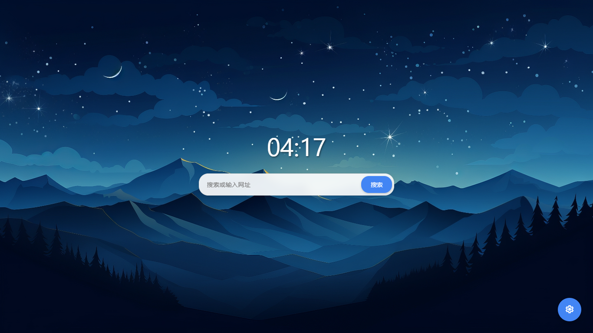
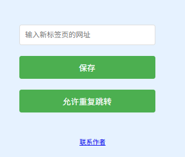

# 🌐 QingTab

## 一款简洁、美观的浏览器起始页

### 🚀 流畅性

- 全代码仅约30KB，轻量至极，加载速度如同闪电，瞬间即可开启清爽的浏览器起始页体验，不会给你的设备增添丝毫负担。

### 🔒 隐私性

- 没有任何广告、跟踪器或其他耗时操作，确保你的隐私和安全。

### 🔍 简洁性

- 没有任何多余的功能或设置，保持简单和纯净的状态，让你专注于你的工作与浏览。

### 🖍 个性化

- 自定义壁纸，还可设为每日必应壁纸

---

### ❓ 如何使用

#### 方法1

1. 打开浏览器设置，将 <https://theoninesixy.github.io/Tools/QingTab/> 设为新标签页

> **提示**：若你的浏览器不支持将第三方网站设为新标签页，请尝试下面的方法 2。

#### 方法2

1. 安装[该插件](https://chromewebstore.google.com/detail/kabdlogpjfnlmgidpodlidkjhbbflkkb?utm_source=item-share-cb)

2. 安装完成后，点击插件图标，点击刚才安装的插件，一般会弹出这个窗口：

    

3. 在上方的地址栏中填入 <https://theoninesixy.github.io/Tools/QingTab/> 后点击下方的保存按钮。

    
